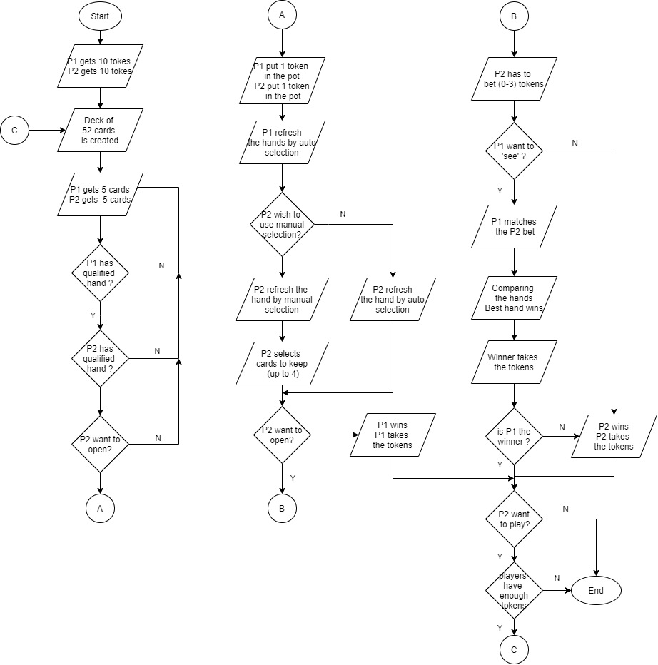
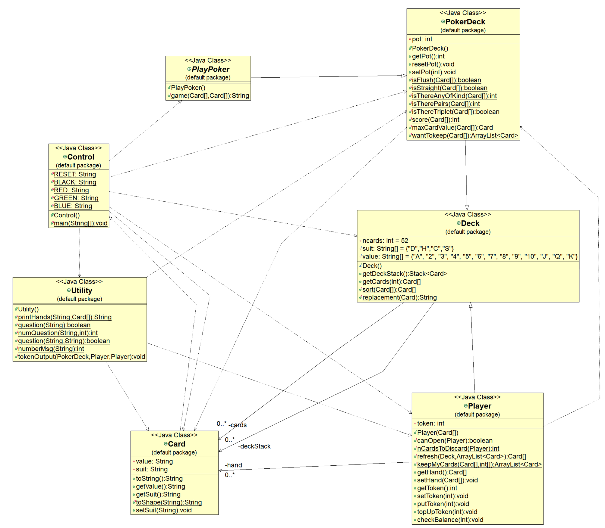

# Java-Poker-Game
This is a UL project to make a Poker game 

### 1. Summary
This assignment is about coding a Poker Game. The game is between the computer (Player 1) and the human player (Player 2). The rules of the game per project specifications are:
1.	For each session, both players start with 10 tokens.
2.	For each round, each player receives 5 cards from the deck.
3.	The players (the code) verify if they are qualified to open, i.e., it needs to have at least a pair of “Jacks”
4.	Player 2 decides if wish to “open” the game. Player 1 by default will always open.
5.	If Player 2 decides to “open”, each player has to place one token “into the pot”
6.	Each player decides if wish to refresh the hands (it must keep at least one card of the original hand)
7.	Player 2 place the bet from 0 to 3 tokens.
8.	Computer decides to let you win or not.
9.	If computer want to “see” your cards, it has to match your bet.
10.	The best hands win and takes the tokens in the pot.
11.	The game ends when Player 2 decides it does or none of them has tokens to continue.

The winning order of hands in poker is:
*	A royal flush (a straight flush starting at Ace and going down through King, Queen, Jack, to Ten)
*	A straight flush (a straight but all in the same suit – the higher the better)
*	Four of a kind (the higher the better)
*	A flush (all the same suit - the higher the better)
*	A straight (for example “4 clubs, 5 spades, 6 clubs, 7 diamond, 8 spades” - the higher the better)
*	A full house (triplets and a pair - the higher the triplets, the better)
*	Triplets (the higher the better)
*	2 pairs (the higher the better)
*	1 pair (the higher the better) 

***
### 2.	Flow Chart

  

***
### 3.	UML – Command Line

 

***
### 4.	GUI - Java FX

                    
